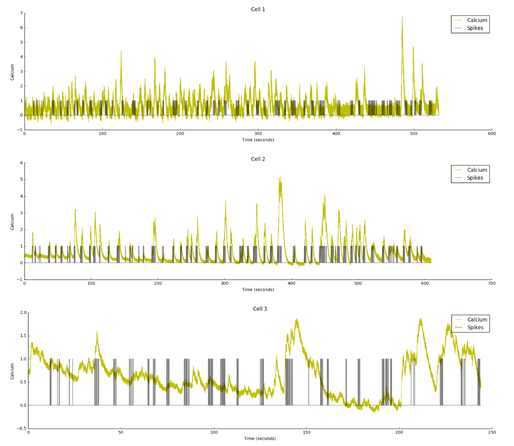
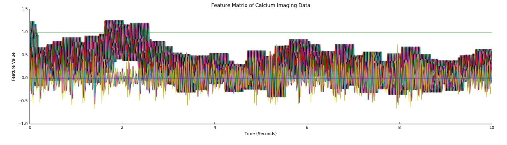
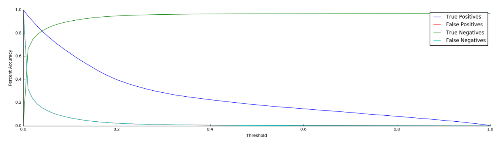
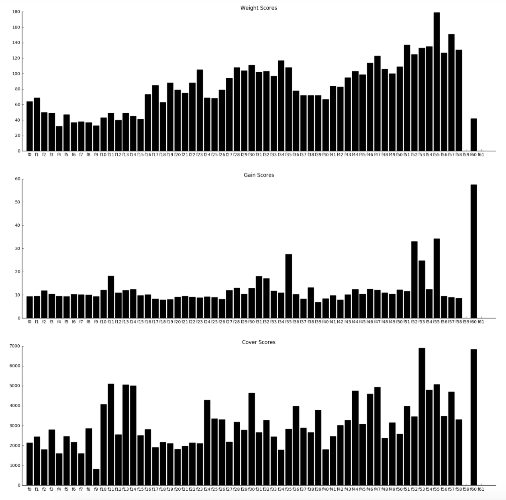

### **Predicting neural spike trains from two-photon calcium imaging**

Maite Azcorra-Sedano, Han Jiang, Torben Noto, Vivek Sagar  
Northwestern University, EECS349 Spring 2017 - Machine Learning

#### <u>Abstract<u>

> A current challenge in neuroscience is determining the spiking of neurons from recordings of features that are related to their firing, but which are naturally noisy and imprecise. Calcium imaging is a popular technique that optically measures intracellular levels of calcium from thousands of neurons simultaneously. Despite several advantages of calcium imaging, it suffers from the drawback that the calcium levels only provide a proxy for neuronal firing. Even though there is a strong biophysical framework to explain how neuronal firing relates to calcium currents, it is not clear how we can mathematically calculate the neuronal spiking from calcium signals due to factors like limited sampling rates and dye-buffering. A precise and fast algorithm for doing this would obviate the need for jointly calibrating the electrophysiological and imaging experiments.
>
> Several computational models (deconvolution filters, Bayesian, biophysical and generalized linear models) have been proposed to predict the spike trains from calcium currents, but their estimation necessitates making several assumptions about the mechanism underlying the relationship between calcium currents and neuronal spiking. Here we implemented several supervised machine learning algorithms which do not require such assumptions, including logistic regression, gradient boosting, feedfoward neural networks, and recurrent neural networks to predict spike trains from calcium signals and their derivatives. RESULTS:
>
> GRAPH:

#### <u> Final Report</u>

#### Introduction

#### Data Acquisition and Feature Selection
We obtained a dataset of concurrent calcium and spiking recordings from the [Collaborative Research in Computational Neuroscience (CRCNS) website](https://crcns.org/data-sets/methods/cai-3/about-ret-2). This dataset contains 5 sessions of the experimentors recording neurons from different parts of the brain using different calcium indicators and under different brain states  (described in detail [here](https://crcns.org/files/data/cai-3/crcns_cai-3_data_description.pdf)). Each session contained between 5-21 neurons and each neuron yielding of the order of 30,000-80,000 time points worth of instances).
After examining the data, several of the recordings appeared to be atypical and were rejected for further analyssis. The subset of the data we analyzed (Fig 1.) contained 781082 time points from 13 cells in the mouse retina and 9 cells in the mouse visual cortex. Spikes are infrequent in neural recordings and our dataset contained 24301 total spikes (3% of the data). The sparisty of positive examples presented a challenge for further analyses. Furthermore, while spikes are discrete events, they tend to occur in bursts called 'spike trains'. The sampling rate of the recordings (100 Hz) was such that multiple spikes were sometimes binned into single time points. Beacuse positive examples of spike events containing more than one spike were even more sparse compared to negative examples, we chose to binarize the spiking.
 
Figure 2. Example calcium (yellow) and spike train (black) traces of 3 cells over time 

Raw calcium signals were converted into features (Fig 2.). For each time point, we calculated the instantanious calcium signal, all of the calcium signals between one second in the future and past, the derivative of the calcium signal, the second deriviative of the calcium signal, a sliding window average of calcium activity over 11 increasingly broad windows. Additionally, we included labels about the brain region that the neurons were recorded from, the cognitive state of the mouse, and the calcium indicator that was used. Because we found that many sessions and cells contained data with low signal to noise ratio (for example, compare cells 2 and 3 from Fig. 1), we selected data from two sessions with high SNR, training on 70% and testing on 30%. (MAITE CAN YOU PROVIDE SOME QUANTITATIVE SNR INFO FOR WHY WE DID 3 AND 5?)
 
Figure 3. Example of extracted features from calcium signal over time

#### Classification Methods 
We implemented 4 supervised learning algorithms to generate predictions of spike patterns from concurrent calcium signal and accompanying extracted features. At a first pass, we implemented logistic regression and feedforward neural nets to examine baseline performance in cases when the classifer does not naturally take into account the temporal nature of the signal. TORBEN ADD REASONING FOR WHY USE XGBOOST? Following this, we implemented a recurrent neural network which applies LSTM to potentially capture temporal dependencies that affect spiking. VIVEK MAY WANT TO ADD TO THIS? I HAVE A PRETTY SIMPLISTIC UNDERSTANDING AS YOU CAN SEE.

##### Logistic Regression:  

First, we applied a logistic regression model, which estimates the probabilistic relationship between independent input and dependent output using a logistic function in order to classify spike trains. We used an empiraclly chose a regularization parameter between L1 and L2 by calculating precision of the training model over all lambdas between 0 and 1, with step size .05, and choosing the lambda with the highest precision. Then we used the output model from the best lambda to test on the independently drawn test dataset.

##### Gradient Boosting:  
We built a gradient boosted decision tree classifier using XGBoost and tensorflow. This classifier builds many weakly accurate decision trees and combines their predictions into an ensemble that tends to be fairly accurate. We used a binary, sigmoidal loss function and optimized several important hyperparameters (L1 regularization, L2 regularization, gamma, and learning step size) of the model to improve performance. All code for training and optimizing gradient boosted trees can be found at [here](https://github.com/torbenator/calcium_spikes)

##### Neural Networks:  
We have constructed a feed forward neural network with 3 hidden layers using Tensorflow and sklearn. The network is trained for a binary classification task. The loss function being used is the probability error (cross entropy softmax with logits). We use Adam optimizer with a learning rate of 0.01 to minimize this loss. The network then predicts the spikes given the test examples.

#### Results

##### Logistic Regression
 
##### Gradient Boosting

##### RNN
 
#### Discussion

Investigating the feature importance scores for the gradient boosted trees provides novel insights to which features contributed to accurate predictions. Perhaps not so surprisingly, the feature that provided on average the most information gain and that was split on the most, was the brain region that the neuron was recorded from (f60). This supports the idea that calcium dynamics are not identical from one neuron to the next, but may be somewhat specific to cell type and cellular environment.
More surprisingly, simultanious calcium level was not a particularly useful feature for predicting spiking. The calcium currents preceeding and following a given time point tended to be used in these trees. Even calcium at times 200 ms before spikes (f53) was a particularly strong contributor to prediction accuracy.

future work: using sliding window derivative.
